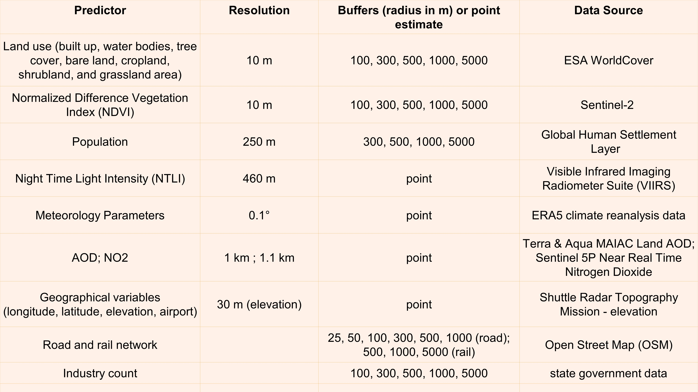
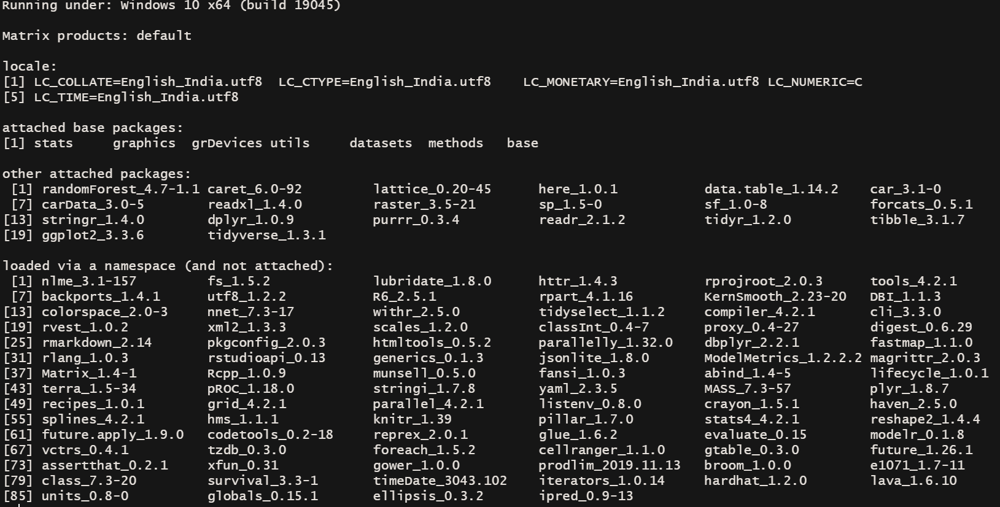

# Building Land Use Regression model - an example

## Overview of the project

- https://adithi-spatial-learning.netlify.app/, made using [Quarto](https://quarto.org/). 
- A portion of LUR project data analysis is shown here as an example.

## Walk through the code

- https://walk-through-lur.netlify.app/, made using [Quarto](https://quarto.org/). 

## Folder overview 
- `R` folder has all the scripts 
  - `functions.R` all custom made functions are defined here
- `index.qmd` is an example document on how to run the Land Use Regression model
- `img` folder has images used in here
- `data` folder has data
  - here the file used for the training, validation, and prediction need to have a column called `CODE` to uniquely identify each point for the analysis; this is usually a `multipoint` object
  - 

## Methodology 

#### Eeftens, M., Beelen, R., De Hoogh, K., Bellander, T., Cesaroni, G., Cirach, M., . & Hoek, G. (2012). Development of land use regression models for PM2.5, PM2.5 absorbance, PM10 and PMcoarse in 20 European study areas; results of the ESCAPE project. Environmental Science & Technology, 46(20), 11195-11205. https://doi.org/10.1021/es301948k

## Variables / Parameters and their buffers 


    
## Land use parameters 

class - renamed_as 
10 - tree_cover
20 - shrubland
30 - shrubland
40 - cropland
50 - builtup
60 - bare_land
70 - snow_ice
80 - per_water_bodies
90 - shrubland
95 - mangroves
100 - moss_lichen

## Column names 

```{r}
"CODE"                    ,   "PM2.5"                      
"lat"                     ,   "long"                       
"tree_cover_buffer_100"   ,   "tree_cover_buffer_1000"     
"tree_cover_buffer_300"   ,   "tree_cover_buffer_500"      
"tree_cover_buffer_5000"  ,   "shrubland_buffer_100"       
"shrubland_buffer_1000"   ,   "shrubland_buffer_300"       
"shrubland_buffer_500"    ,   "shrubland_buffer_5000"      
"cropland_buffer_100"     ,   "cropland_buffer_1000"       
"cropland_buffer_300"     ,   "cropland_buffer_500"        
"cropland_buffer_5000"    ,   "builtup_buffer_100"         
"builtup_buffer_1000"     ,   "builtup_buffer_300"         
"builtup_buffer_500"      ,   "builtup_buffer_5000"        
"bare_land_buffer_100"    ,   "bare_land_buffer_1000"      
"bare_land_buffer_300"    ,   "bare_land_buffer_500"       
"bare_land_buffer_5000"   ,   "per_water_bod_buffer_100"   
"per_water_bod_buffer_1000",   "per_water_bod_buffer_300"   
"per_water_bod_buffer_500",   "per_water_bod_buffer_5000"  
"rail_buffer_1000"        ,   "rail_buffer_500"            
"rail_buffer_5000"        ,   "pop_buffer_300m"            
"pop_buffer_500m"         ,   "pop_buffer_1000m"           
"pop_buffer_5000m"        ,   "inverse_distance_industries"
"inverse_distance_airport",   "elevation"                  
"aod"  

```

## Other similar models 

- Machine learning model:
  - [`Random forest`](https://link.springer.com/article/10.1023/a:1010933404324?utm_source=getftr&utm_medium=getftr&utm_campaign=getftr_pilot) using [`ranger`](https://cran.r-project.org/web/packages/ranger/ranger.pdf)

- Geostatistical model:
  - [`Geographically weighted regression`](https://onlinelibrary.wiley.com/doi/abs/10.1111/j.1538-4632.1996.tb00936.x) using [`GWmodel`](https://cran.r-project.org/web/packages/GWmodel/GWmodel.pdf)

## Session information and package versions 



## LICENSE

[Click here.](https://github.com/adithirgis/code_examples/blob/main/LICENSE)
