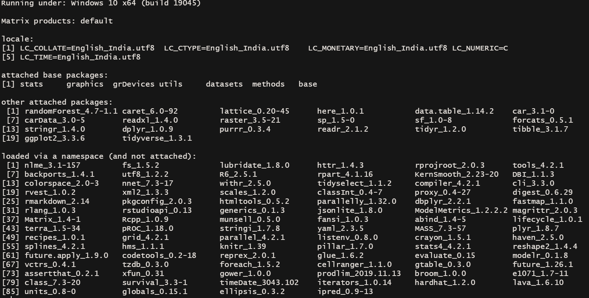

# Codes for example

## Overview of the project

https://adithi-spatial-learning.netlify.app/, made using [Quarto](https://quarto.org/). 

## Folder overview 
- `R` folder has all the scripts 
  - `functions.R` functions defined here; here the file used for the training, validation, and prediction need to have a column called `CODE` to uniquely identify each point for the analysis
  - `example.qmd` example document to run
- `img` folder has images 
- `data` folder has data

## Session information and package versions 

## LICENSE

[Click here.](https://github.com/adithirgis/code_examples/blob/main/LICENSE)
