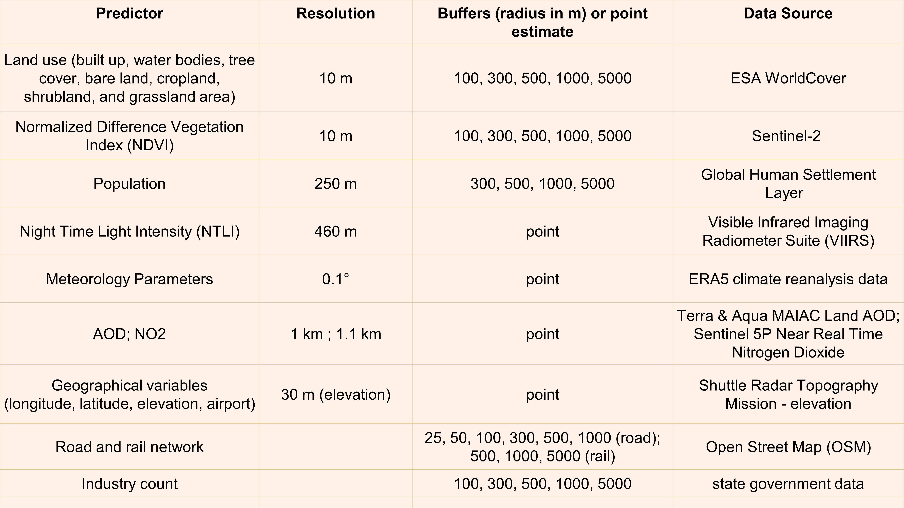

## Introduction 

- Land Use Regression (LUR) modeling is a statistical approach capable of predicting pollution levels at a high spatial resolution. 
- In this study, pollution data for 2019 from a regulatory monitoring network in Delhi, India, was used to develop simple linear and interpretable LUR models for various criteria pollutants. 
- The PM concentration levels were 2.5-4 times higher than the prescribed national ambient standards.


:::{.callout-important}
We adopted the European Study of Cohorts for Air Pollution Effects
(ESCAPE) methodology (Eeftens et al., 2012) for building the LUR models.
:::

## Setting up

- Source the [functions.R](https://github.com/adithirgis/code_examples/blob/main/R/functions.R) file that has custom-functions and loads the required libraries. 
- Some tables shown here are restricted to 5 observations. For detailed view check in RStudio after cloning this repository [here](https://github.com/adithirgis/code_examples).

::: {.callout-important}
All spatial datasets must first be projected into the same CRS before distances / buffers are calculated or generated.
:::

```{r}
#| echo: fenced
#| label: load-libraries
source(here::here("R", "functions.R"))
theme_lur <- function() {
  list(
    theme_classic(),
    theme(
      plot.title = element_text(size = 12, face = "bold"),
      legend.text = element_text(size = 14, face = "bold"),
      legend.title = element_blank(),
      legend.position = "bottom",
      axis.title = element_text(size = 16, 
                                colour = "black", 
                                face = "bold"),
      axis.text.x = element_text(size = 12, 
                                 colour = "black"),
      axis.text.y = element_text(size = 14, 
                                 colour = "black", 
                                 face = "bold"),
      panel.border = element_rect(colour = "black", 
                                  fill = NA, 
                                  linewidth = 1),
      strip.text = element_text(size = 14, face = "bold")
    )
  )
}
```


## Coordinate reference systems and Response variable

- Define the coordinate system used for collecting data, here we used the Geographic coordinate system is [`wgs`](https://gisgeography.com/wgs84-world-geodetic-system/) and for the projected coordinate system, we used [`UTM_proj`](https://www.distancesto.com/coordinates/in/central-delhi-latitude-longitude/history/281282.html).
- `_proj` suffix in dataframes denotes that data is converted to `UTM_proj` CRS. 
- Define your response variable / the variable you want to predict the values for.

```{r}
#| echo: fenced
#| label: define-projections
wgs <- "+proj=longlat +datum=WGS84 +no_defs"
UTM_proj <- "+proj=utm +zone=43 +datum=WGS84" 
response_variable <- "PM2.5"
varname <- sym("PM2.5")
```

## Delhi sites data

- Read the Delhi data, please make sure all training and predicting dataset has a **CODE** (this column is case sensitive as well) a column to uniquely identify the points of training / or each site of interest.

::: {.callout-note}
The **CODE** is super important and is used for deriving variables from Earth Engine as well, after we derive from various sources we use this column to join multiple predictors / variables dataframe. 
:::

```{r}
#| echo: fenced
#| label: read-data-transform
delhi_sites_df <- read.csv(here("data/Delhi_code_spatial_info", "Delhi_site_lat_long_info.csv")) %>% 
  distinct(CODE, .keep_all = TRUE) %>% 
  mutate(lat = latitude, long = longitude)

delhi_sites_sf <- convert_sf(delhi_sites_df, wgs, 
                             "longitude", "latitude")
delhi_sites_proj <- convert_sf_proj(delhi_sites_df, wgs, 
                                    UTM_proj, "longitude", "latitude") %>% 
  dplyr::select(CODE, lat, long)

delhi_sites_proj %>% 
  head() %>% 
  gt() %>% 
  tab_options(
  table.font.size = px(13),
  data_row.padding = px(3)
  ) %>% 
  tab_options(container.overflow.x = TRUE,
  container.overflow.y = TRUE)
```

## View Delhi sites (interactive map)

```{r}
#| echo: fenced
#| label: view-delhi-sites
mapview(delhi_sites_proj)
```

## Data introduction

- Number of monitoring sites: 40

- Predictor variables: 44

- Response variable: PM2.5

- Missing values: 5

| Category    | Number |
| ----------- | -----: |
| Land-use    |     25 |
| Railway     |      3 |
| Population  |      4 |
| NDVI        |      5 |
| Meteorology |      4 |
| Geographic  |      3 |

## Load the table of desired direction of effect of the parameters

- The direction of effect table specifies the expected sign of each predictor before model fitting. 
- The direction-of-effect table specifies whether each predictor is expected to increase or decrease PM~2.5~ according to previous published literature or prior knowledge.

::: {.callout-important}
During model development, these expected signs are compared with the estimated regression coefficients to help identify predictors that may be statistically significant but environmentally implausible.
:::


::: {.callout-note}
- Green spaces are expected to have negative coefficients because they reduce pollution.
- Road length variables are expected to increase pollution.
- Elevation is expected to reduce concentrations.
:::


```{r}
#| echo: fenced
#| label: read-direction-of-effect-table
direction_of_effect_table <-
  read_csv(here("data/direction_of_effect", 
                "parameters_pm.csv")) %>% 
  dplyr::select(param, sign, val)
```

```{r}
#| echo: FALSE
#| label: table
df <- tibble(
  Category = c(
    "\U1F333 Land use",
    "\U1F333 Land use",
    "\U1F6E3 Transport",
    "\U1F686 Transport",
    "\U1F465 Population",
    "\U2708 Emission source",
    "\U1F33F Environmental"
  ),
  Predictor = c(
    "Tree cover",
    "Built-up area",
    "Road length",
    "Railway length",
    "Population density",
    "Airport distance",
    "NDVI"
  ),
  `Expected Effect` = c(
    "\u2193 PM\u2082.\u2085",
    "\u2191 PM\u2082.\u2085",
    "\u2191 PM\u2082.\u2085",
    "\u2191 PM\u2082.\u2085",
    "\u2191 PM\u2082.\u2085",
    "\u2193 PM\u2082.\u2085 with increasing distance",
    "\u2193 PM\u2082.\u2085"
  ),
  Why = c(
    "Vegetation enhances pollutant deposition and dispersion.",
    "Urbanized areas generally increase emissions and pollutant accumulation.",
    "Higher traffic density leads to increased vehicle emissions.",
    "Rail operations and associated transport activities contribute to emissions.",
    "Greater human activity is typically associated with higher emissions.",
    "Pollutant concentrations generally decrease farther from airport emission sources.",
    "Greener surroundings promote pollutant removal and improve air quality."
  )
)

gt(df)
```

## Methodology

```{mermaid}
graph LR

A[Raw GIS Data]
B[Extract GIS predictors]
C[Generate Buffers]
D[Correlation screening]
E[Forward stepwise selection]
F[LUR Modelling]
G[Validation]
H[Final LUR model]

A --> B
B --> C
C --> D
D --> E
E --> F
F --> G
G --> H
```


## Variables added to the model building

{fig-align="center" width="70%"}

## Reading in other spatial predictors

1. Airport coordinates in the object `airport`. 
2. Industries coordinates in the object `industries`.
3. Railways in the `railway_proj` object which is projected.
4. Convert all of them to projected coordinate system.

::: {.callout-note}
Predictors like land use, NDVI, NTLI are extracted using circular buffers centred on each monitoring site.
:::

```{r}
#| echo: fenced
#| label: read-spatial-predictors
airport <- read_csv(here("data/airport", "airport_point.csv")) 
airport_proj <- convert_sf_proj(airport, wgs, UTM_proj, "Longitude", "Latitude")
filters_to_check <- c("stone cutting", "foundry", "metal fabrication",
                      "rubber", "plastic", "electricals/metal fabrication/moulds", 
                      "Paper & pulp", "machines", "glass works", "charcoal", 
                      "RMC", "rice mill", "flyash bricks", "forging")
industries <- read_csv(here::here("data/industries", "Delhi_Industry_Details.csv")) %>% 
  filter(Type %in% filters_to_check)
industries_proj <- convert_sf_proj(industries, wgs, UTM_proj, "Long", "Lat")
railway_proj <- proj_sf(here("data/railways", "Delhi_railways.shp"), UTM_proj)
```


## Example: View Railways (interactive map)

```{r}
#| echo: fenced
#| label: view-railway-data
mapview(
  delhi_sites_proj,
  col.regions = "purple",
  cex = 5,
  layer.name = "Monitoring sites"
) +
mapview(
  railway_proj,
  color = "black",
  lwd = 2,
  layer.name = "Railway"
) 
```

## Railway length within 1000m (buffer of radius 1000m: interactive map)


```{r}
#| echo: fenced
#| label: view-buffers

buffering_railway <- lur_buffer_maker(name = "rail_buffer_", 
                                      buffer_len = c(500, 1000, 5000))
buffers <- buffer_points(buffering_railway, delhi_sites_proj)
buffers_railway <- mapply(FUN = sf::st_intersection,
                      x = buffers,
                      MoreArgs = list(y = railway_proj),
                      SIMPLIFY = FALSE, 
                      USE.NAMES = TRUE)

mapview(
  delhi_sites_proj,
  col.regions = "purple",
  cex = 1,
  layer.name = "Monitoring sites"
) +
mapview(
  buffers$rail_buffer_1000m,
  map.types = "CartoDB.Positron",
  col.regions = "white",
  color = "blue",
  lwd = 1
)
```


## View Railway lines inside of buffer of radius 1000 m for each site

- From this step we calculate length of railway in that buffer.

```{r}
#| echo: fenced
#| label: view-railway-buffers

mapview(
  buffers$rail_buffer_1000m,
  alpha.regions = 0.2,
  color = "blue",
  lwd = 1,
  legend = FALSE
) +
mapview(
  buffers_railway$rail_buffer_1000m,
  color = "black",
  lwd = 2,
  legend = FALSE
)
```

## Extracting distance variables like distance from airport and industries for all sites

```{r}
#| echo: fenced
#| label: extract-spatial-predictors
delhi_sites_proj_var <- 
  extract_dist_variable(delhi_sites_proj, 
                        airport = airport_proj,
                        industries = industries_proj)
delhi_sites_proj_var %>% 
  head() %>% 
  gt() %>% 
  tab_options(
  table.font.size = px(13),
  data_row.padding = px(3)
  ) %>% 
  tab_options(container.overflow.x = TRUE,
  container.overflow.y = TRUE)
```


## Reading and extracting raster like AOD, Elevation for all sites

```{r}
#| echo: fenced
#| label: extract-raster-predictors
dem_name <- "Delhi_SRTM_Elevation.tif"
aod_name <- "Delhi_AOD_map_2019.tif"

aod <- raster(here("data/AOD/interpolated", aod_name))
dem <- raster(here("data/DEM", dem_name))

delhi_sites_proj_var <- extract_raster(delhi_sites_proj_var, 
                                       dem, aod, wgs, UTM_proj)
```

## Adding land use, population parameters

- The land use land cover, NDVI, and population parameters were derived using [Earth Engine](https://earthengine.google.com/).
- The codes for Earth Engine parameter / predictor / variable extraction is in this [folder](https://github.com/adithirgis/code_examples/tree/main/earth_engine_codes). 
- The land use, population, and the railway lengths are replaced with `0` wherever the values were `NA`.
- The PM~2.5~ data for each site in Delhi is also added at this step. 

```{r}
#| echo: fenced
#| label: read-other-predictors
lulc_file_name <- "lulc_vars.csv"
pop_file_name <- "pop_vars.csv"

df_railway <- extract_railway(buffering_railway,
                              delhi_sites_proj_var,
                              railway_proj)

file_lulc <- read_csv(here::here("data/landuse", lulc_file_name))
file_lulc <- file_lulc %>% 
  dplyr::select(everything(), -`...1`) 
df_lulc <- derive_lulc_as_df(file_lulc)

df_pop <- read.csv(here::here("data/population", pop_file_name), 
                   sep = ",") 

dataframe_all_params <- list(df_lulc, df_railway, df_pop) %>% 
  reduce(left_join, by = "CODE") %>%
  as.data.frame() %>% 
  dplyr::select(where(~!all(is.na(.x)))) %>% 
  mutate_if(is.numeric, ~replace_na(., 0)) 

pollutant_data <- read.csv(here("data/training_data",
                                "yearly_avg_2018_2021.csv")) %>% 
  mutate(PM2.5 = as.numeric(as.character(pm25)),
         CODE = site) %>% 
  filter(year == 2019) %>% 
  dplyr::select(CODE, !!!response_variable)
  
dataframe_all_params <- list(dataframe_all_params, delhi_sites_proj_var, pollutant_data) %>% 
  reduce(left_join, by = "CODE") %>%
  as.data.frame() %>% 
  dplyr::select(CODE, lat, long, contains("ndvi"), everything(), 
                -geometry) 

dataframe_all_params %>% 
  head() %>% 
  gt() %>% 
  tab_options(
  table.font.size = px(13),
  data_row.padding = px(3)
  ) %>% 
  tab_options(container.overflow.x = TRUE,
  container.overflow.y = TRUE)
```

## Performing univariate regression 

```{r}
#| echo: fenced
#| label: data-summary
dataframe_all_params <- dataframe_all_params %>% 
  dplyr::select(where(~!all(is.na(.x)))) %>% 
  dplyr::select(CODE, !!!response_variable, 
                lat, long, contains("ndvi"), 
                everything())

col <- names(dataframe_all_params)[-c(1:2)]
dataframe_all_params[, col] <- 
  sapply(X = dataframe_all_params[, col],
         FUN = function(x)
           as.numeric(as.character(x)))

dataframe_all_params %>%
  dplyr::select(everything(), 
                -starts_with(c("snow_", "mang_", "moss_"))) %>% 
  dplyr::select(-c(CODE, lat, long)) %>%
  mutate(across(everything(), as.numeric)) %>% 
  gtsummary::tbl_summary(
    type = everything() ~ "continuous",
    statistic = everything() ~
      "{mean}; {sd}; {median} ({p25}, {p75})",
    digits = everything() ~ 1
  )
```

::: {.callout-note}
Before fitting the land-use regression model, it is useful to examine correlations among predictor variables. Highly correlated predictors may introduce multicollinearity, resulting in unstable coefficient estimates and inflated standard errors. 
:::

## Model Development workflow

```{mermaid}
flowchart TD

A["Candidate GIS & Remote Sensing Predictors"]
B["Univariable Screening<br/>(Highest R² + Expected Effect)"]
C["Forward Stepwise Variable Selection<br/>(≥ 1% Increase in Adjusted R²)"]
D["Significance Testing<br/>(p ≤ 0.10)"]
E["Multicollinearity Check<br/>(VIF ≤ 3)"]
F["Influential Observation Analysis<br/>(Cook's Distance)"]
G["Spatial Autocorrelation Assessment<br/>(Moran's I)"]
H["LOOCV Validation<br/>(Leave-One-Out Cross-Validation)"]
I["Final Model Evaluation<br/>(Adjusted R² • RMSE • NRMSE)"]

A --> B --> C --> D --> E --> F --> G --> H --> I
```

- Here, we performed the univariate regression (ex: `PM2.5` vs `ndvi_buffer_200m`) to find out the parameter which has the highest R^2^ and the desired direction of effect.
- We created an empty dataframe `data_univariate_summary` to add the values for univariate regression.
- We also checked for continuous repeated values in the columns using a data frame `cou`.
- We check if a column has more than one non-zero or non-NA value to build the model.
- This step is necessary as we have replaced `NA` values with `0` and also we need more than one value to build a linear model.
- Check if column exists after cleaning and then iteratively perform univariate regression.
- Apply `add_sign_check` to the `data_univariate_summary` / univariate regression table we generated, keep the variables where the desired direction / sign of effect is preserved. 
- Extract the highest R^2^ and the parameter which has the highest R^2^.


```{r}
#| echo: fenced
#| label: univariate-regression
data_univariate_summary <- tibble::tibble(
  value = character(),
  slope = numeric(),
  intercept = numeric(),
  R2 = numeric(),
  f_val = numeric(),
  p_val = numeric()
)

x <- c("value", "slope", "intercept", 
       "R2", "f_val", "p_val")
colnames(data_univariate_summary) <- x
perc <- round(0.75 * nrow(dataframe_all_params))

results <- vector("list", length(col))
k <- 0
for (i in col) { 
  dataframe_all_params <- 
    dataframe_all_params[vapply(dataframe_all_params, 
                                function(x) length(unique(x)) > 1, 
                                logical(1L))]
  if(i %in% colnames(dataframe_all_params)) {
    cou <- (dataframe_all_params %>% 
              group_by(!!!syms(i)) %>% 
              summarise(n = n()) %>% 
              filter(n == max(n)))$n[1]
    if(cou < perc) {
      form <- reformulate(i, response_variable)
      univariate_model <- lm(form, data = dataframe_all_params)
      k <- k + 1

      model_summary <- summary(univariate_model)
      f <- model_summary$fstatistic
      results[[k]] <- tibble::tibble(
        value = as.character(i), 
        slope = model_summary$coefficients[2, 1],
        intercept = model_summary$coefficients[1, 1],
        R2 = model_summary$adj.r.squared,
        f_val = model_summary$fstatistic[[1]], 
        p_val = pf(f[1], f[2], f[3], lower.tail = FALSE)
      )
     } else {
      data_univariate_summary <- data_univariate_summary
    }
  }
}
data_univariate_summary <- dplyr::bind_rows(results[1:k])

data_univariate_summary <- add_sign_check(data_univariate_summary, 
                                          direction_of_effect_table)

data_univariate_summary <- data_univariate_summary %>%
  filter(obj != FALSE)

highest_para <- (data_univariate_summary %>% 
                   arrange(desc(R2)))$value[1]  
original_para <- highest_para
highest_r2 <- (data_univariate_summary %>% 
                   arrange(desc(R2)))$R2[1]
original_r2 <- highest_r2
```
## Stepwise supervised linear regression

- The highest R^2^ in the univariate model is `r original_r2` and the parameter is `r original_para`.
- We will now perform the stepwise supervised linear regression.

```{r}
#| echo: fenced
#| label: stepwise-supervised-linear-regression
dataframe_all_params <- dataframe_all_params %>% 
  dplyr::select(CODE, !!!response_variable, everything())

col_interest <- colnames(dataframe_all_params[, -c(1:2)])
dataframe_all_params[, col_interest] <- 
  sapply(X = dataframe_all_params[, col_interest],
         FUN = function(x) as.numeric(as.character(x)))

c(variable_list, change_in_r2, 
  highest_r2, df_slope_info, 
  df_r2_info) := 
  run_lur_model(col_interest, original_para, 
                original_r2, response_variable, 
                dataframe_all_params, 
                direction_of_effect_table, 0.01)
```


## Results of stepwise supervised linear regression

- The change in R^2^ was observed to be `r change_in_r2`, the multivariate model adjusted R^2^ now is `r highest_r2`. 
- The parameter / variables included in this model with highest R^2^ is `r variable_list`.
- The dataframe with the best models (highest R^2^ with right direction of effect of all included variables / parameters) at each step of adding a variable or parameter is shown below. 

```{r}
#| echo: fenced
#| label: view-table
df_r2_info %>% 
  arrange(desc(r2)) %>% 
  gt() %>% 
  tab_options(
  table.font.size = px(13),
  data_row.padding = px(3)
  ) %>% 
  tab_options(container.overflow.x = TRUE,
  container.overflow.y = TRUE)
```


## Model building

- Select relevant variables to make a new dataframe / df `dataframe_selected_params` from the orignal all parameter / variable list `dataframe_all_params`. 
- Once the variable list is identified and the dataframe selected, build the model (`my_model_built`) and look at the summary. 


```{r}
#| echo: fenced
#| label: model-building
others <- paste(variable_list, collapse = " + ")
dataframe_selected_params <- 
  dataframe_all_params[ , which(names(dataframe_all_params) 
                                %in% c(variable_list, 
                                       response_variable, "CODE"))]
equ <- as.formula(paste(response_variable, others, sep = " ~ "))
my_model_built <- lm(as.formula(equ), 
                     data = dataframe_selected_params)

tidy(my_model_built, conf.int = TRUE) %>% 
  gt() %>% 
  tab_options(
  table.font.size = px(13),
  data_row.padding = px(3)
  ) %>% 
  tab_options(container.overflow.x = TRUE,
  container.overflow.y = TRUE)
```

## Check `p-value` of the model

- Once model built, check for p-values of all the parameters in the model and remove those with p-value > than `0.1`.
- Check if the desired direction of effect for the remaining parameters is still preserved using `data_to_check_for_direction_of_effect_after_cleaning`.

```{r}
#| echo: fenced
#| label: check-pvalue
dataframe_selected_params_p <- remove_p_value(my_model_built, 
                                              dataframe_selected_params, 
                                              0.1) 

my_model_built <- create_model(dataframe_selected_params_p, 
                               response_variable)

tidy(my_model_built, conf.int = TRUE) %>% 
  gt() %>% 
  tab_options(
  table.font.size = px(13),
  data_row.padding = px(3)
  ) %>% 
  tab_options(container.overflow.x = TRUE,
  container.overflow.y = TRUE)

data_to_check_for_direction_of_effect_after_cleaning <- 
  vars(my_model_built, sig_star, direction_of_effect_table)
```

## Check `vif` of the model

- Next we generate variance inflation factor (VIF) of the model to check for collinearity. 
- We remove parameters / variables from the model built in the previous step with vif > 3. 
- We build the model again and check for p-value using the function `remove_p_value`. 
- Check if the desired direction of effect for the remaining parameters is still preserved using `data_to_check_for_direction_of_effect_after_cleaning`.


```{r}
#| echo: fenced
#| label: check-vif
dataframe_selected_params_p_vif <- vif_function(my_model_built, 
                                                dataframe_selected_params_p, 
                                                3)
my_model_built <- create_model(dataframe_selected_params_p_vif, 
                               response_variable)

tidy(my_model_built, conf.int = TRUE) %>% 
  gt() %>% 
  tab_options(
  table.font.size = px(13),
  data_row.padding = px(3)
  ) %>% 
  tab_options(container.overflow.x = TRUE,
  container.overflow.y = TRUE)

data_to_check_for_direction_of_effect_after_cleaning <- 
  vars(my_model_built, sig_star, direction_of_effect_table)
```

## Cook's distance 

- VIF of the model built did not remove parameters / variables from the model (< 3). 
- Calculate the cook's distance to remove influential observations.
- Plot the cook's d values for the model built at the previous step. 


```{r}
#| echo: fenced
#| label: check-cooksdist
cooks_dist <- as.data.frame(cooks.distance(my_model_built)) %>% 
  dplyr::select("CD" = `cooks.distance(my_model_built)`) %>% 
  filter(CD >= 1)

plot(cooks.distance(my_model_built), 
     ylab = "cook's distance", 
     xlab = "observation")
no_rem <- nrow(cooks_dist)
```

- The no of rows which have cook's d  > than 1 are `r no_rem`.
- If cook's distance is > 1 for any observation remove that from the `dataframe_selected_params_p_vif` else keep all the observations. 
- Here we do not have any influential observation.

```{r}
#| echo: fenced
#| label: remove-cooksdist
if(dim(cooks_dist)[1] == 0) {
  dataframe_selected_params_p_vif_cd <- dataframe_selected_params_p_vif
} else {
  dataframe_selected_params_p_vif_cd <-
    dataframe_selected_params_p_vif[-as.numeric(row.names(cooks_dist)), ]
  dataframe_selected_params_p_vif_cd <-
    dataframe_selected_params_p_vif[as.numeric(row.names(cooks_dist)), ]
  
  my_model_built <- create_model(dataframe_selected_params_p_vif_cd, 
                                 response_variable)
  data_to_check_for_direction_of_effect_after_cleaning <- 
    vars(my_model_built, sig_star, direction_of_effect_table)
}
```


## Final model building 

- Build the final model. 
- Check p-value and use this model for validation. 

```{r}
#| echo: fenced
#| label: final-model
final_model_built <- create_model(dataframe_selected_params_p_vif_cd, 
                                  response_variable)

tidy(final_model_built, conf.int = TRUE) %>% 
  gt() %>% 
  tab_options(
  table.font.size = px(13),
  data_row.padding = px(3)
  ) %>% 
  tab_options(container.overflow.x = TRUE,
  container.overflow.y = TRUE)
```

## Leave One Out Cross Validation (LOOCV)

- Perform LOOCV on the final model built.

```{r}
#| echo: fenced
#| label: loocv-model
others <- 
  names(dataframe_selected_params_p_vif_cd[, 
                                           !names(dataframe_selected_params_p_vif_cd)
                                           %in% c(response_variable, "CODE")])

equ <- as.formula(paste(response_variable, paste(others, collapse = "+"), sep = " ~ "))

dataframe_selected_params_p_vif_cd_loocv <- loop_loocv(dataframe_selected_params_p_vif_cd, 
                                                       response_variable) %>% 
  dplyr::select(CODE, contains("predicted"))

mean_adj_r2 <- 
  round(mean(dataframe_selected_params_p_vif_cd_loocv$predicted_loocv_r2_adj, 
             na.rm = TRUE), digits = 2)
```

- The mean adjusted R^2^ for LOOCV is `r mean_adj_r2`.


## Spearman's coefficient and model saving

- Predict using the final model to calculate Spearman's coefficient.
- Calculate the residuals.
- Save the model in `.rds` format if required. 
- Save the residual in `GeoPackage` format or any other desired format. 

```{r}
#| echo: fenced
#| label: final-steps
# saveRDS(all_data, "pm2.5_2019.rds")

dataframe_selected_params_p_vif_cd$predicted_model <- 
  predict(final_model_built, newdata = dataframe_selected_params_p_vif_cd)

cor.test(dataframe_selected_params_p_vif_cd$predicted_model, 
         dataframe_selected_params_p_vif_cd$PM2.5, method = "spearman")

file_sf_season <- delhi_sites_df %>% 
  dplyr::select(CODE, lat, long) %>% 
  left_join(., dataframe_selected_params_p_vif_cd, 
            by = "CODE", suffix = c("", ".y")) %>% 
  dplyr::select(-ends_with(".y")) %>%  
  mutate(residual = !!varname - predicted_model) %>% 
  st_as_sf(., coords = c("long", "lat"), crs = wgs) 

# st_write(file_sf_season, dsn = here("pm2.5_2019.geojson"), driver = 'GeoJSON')
```


## Observed vs Predicted values

```{r}
#| echo: fenced
#| label: predicted_vs_observed
ggplot(dataframe_selected_params_p_vif_cd, 
       aes(x = !!varname, y = predicted_model)) + 
  geom_point() + geom_abline() +  
  scale_x_continuous(limits = c(0, NA)) + 
  scale_y_continuous(limits = c(0, NA)) + 
  labs(x = "observed", y = "predicted") + 
  theme_lur()
```

## Results and Discussions 

- Land use related variables were found to be the most common predictors of the observed pollution levels. 
-  The generated maps can be used for better estimates of disease burden, to identify the potential determinants of spatial variability in air pollution, and to help governments identify hot spots and prioritize mitigation activities. 
- The spatial maps also reveal large heterogeneity in pollution concentrations within the Delhi region suggesting that relying on stationary data alone could lead to exposure misclassification for epidemiological purposes.

## Limitations 

- The LUR models developed in this study are linear models using non-transformed predict and and predictor data. Given the dynamic and transient nature of the pollution sources observed in LMICs, a non-linear relationship is possible. 
-  As most of the predictors considered in the present study are spatial variables with little or no temporal variability, temporally averaged spatial predict and data was used for the modeling exercise. 
- This has limited the number of spatial data points available for modeling (N ~ 40), which led to the choice of simple linear regression models over machine learning models.
- Geographic representation is uneven.
- Some variables contained missing observations.

## References

- Agrawal, P., Upadhya, A. R., Srishti, S., Kalshetty, M., Kulkarni, P., Kushwaha, M., & Sreekanth, V. (2024). Development of Land Use Regression (LUR) models and high-resolution spatial mapping of criteria air pollutants: Leveraging Delhi's continuous air monitoring network and remote sensing data. Journal of Atmospheric and Solar-Terrestrial Physics. Doi: 10.1016/j.jastp.2024.106385.
- Eeftens, M., Tsai, M.Y., Ampe, C., Anwander, B., Beelen, R., Bellander, T., et al., 2012. Spatial variation of PM2.5, PM10, PM2.5
absorbance and PM coarse concentrations between and within 20 European study areas and the relationship with NO2–results of the ESCAPE project. Atmos. Environ. 62, 303–317. Doi: 10.1016/j.atmosenv.2012.08.038.